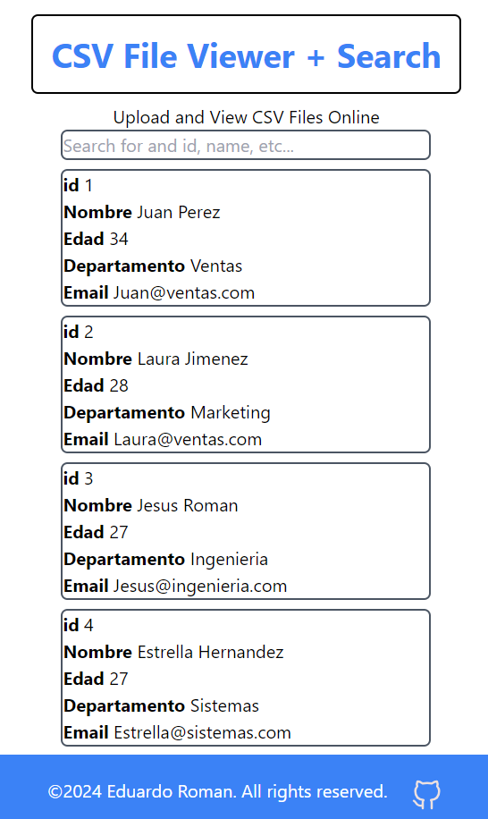

# Full Stack REST API - SPA - CSV File Viewer - Monorepo w NPM Workspaces

Web Application that allow users to upload CSV file with pre formated data and able to show those data as cards in the frontend, additionally able to filter in a search bar. This leads to a full stack project where the best practices in the RESTful API were showed.

## Built with
 
 
 
  
  
  
  
 

## Overview
### Frontend
-SPA  
-NO Magic Strings to avoid make it more error-prone, and difficult to maintain as it evolves over time. 

    

-Search bar to find/filter the results we want(id, name, email, etc...). 

    

-Sooner package for toast component to make it friendly the errors. 
-window.history.pushState() used to modify the search history without reaload the browser and make it more friendly and efficient to the user.

### Backend
-RESTful API. 
-Best practices for the API, accept (in this case since it's a file first we have to check the buffer then convert csv to json) and response with JSON, naming conventions, allowing filtering, handle errors gracefully and return standard error codes. 

    

    

-Multer middleware for handling multipart/form-data, for our csv file. 
-Part of Multer middleware, convert csv to json function to be able to recieve JSON and response with so to get stick to good practices.

## UI States

### Looking at our CSV file
Before selecting our file  let's see how it looks

    

Now let's select our file

    

### After selecting a file

    

Now we are ready to hit the upload button and show the result but first...

### Uploading the file 

    

The uploading state is now on scene.

### Showing the Cards with the result of the CSV

    

All the results are listed as a card, each inside a div with all the information.

### Toasts
File uploaded successfully

    

Error

    

## Filtering the data and window.history.pushState()
Filter by Number

    

Filter by Name

    

Filter by Department Area

    

How pushState handles the searches

    

